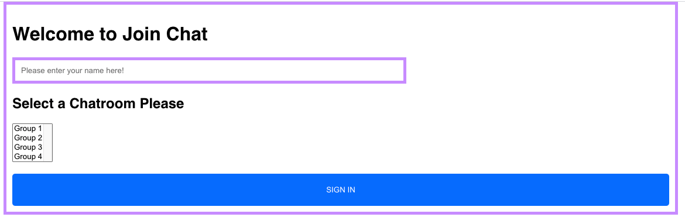
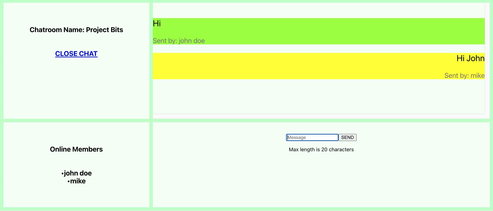

# LiveChatApplication
The application allows the users to communicate with each other in real-time. Different chatrooms are isolated from each other. 
Moreover, there is a list of online members which is updated continuously as a user joins or leaves the chat.

## Technologies 
Node.js, Expressjs, SocketIO and React

### How to setup

 1. Go to main directory LiveChatApplication
 2. cd into Backend folder and run npm install
 3. Run another command node app.js
 4. cd back into the main directory and go to the client
 5. Run npm install, followed by npm start
 6. Finally, enter the URL http://localhost:3000/joinchat

### Screenshots

