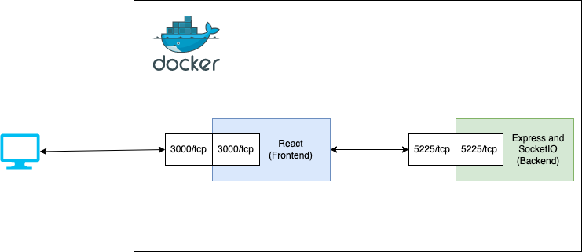

# LiveChatApplication
The application enables real-time communication between users, with distinct chatrooms that are separated from each other. Additionally, there is a constantly updated list of online members, reflecting user activity as they join or exit the chat.


## Technologies 

**Backend:** Node.js, Express.js, and Socket.IO and React <br>
**Frontend:** Node.js, React, and Socket.IO Client
## Architecture



### How to setup and run the application

#### Option A: Docker Compose - Recommended 

1. Open terminal.
2. Go to project's main directory - LiveChatApplication.
3. Make sure Docker is installed on your OS.
4. Enter the following command in terminal.
```console
docker-compose up  
```
5. Finally, enter the URL http://localhost:3000/joinchat in your browser.

#### Option B: Manual Setup

 1. Open terminal.
 2. Go to project's main directory - LiveChatApplication.
 3. cd into socket_server folder and run npm install.
 4. Run another command node app.js to start the backend express application.
 5. cd back into the main directory and go to the react_client folder.
 6. Run npm install, followed by npm start. It will start the react frontend.
 7. Finally, enter the URL http://localhost:3000/joinchat in your browser.

### Application Screenshots

